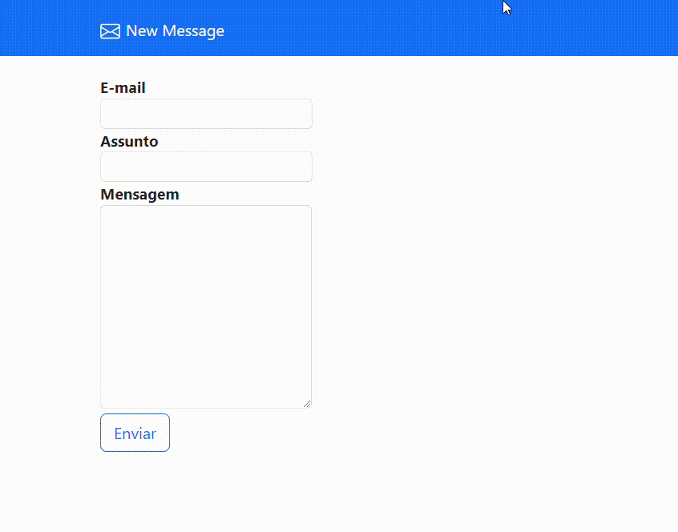
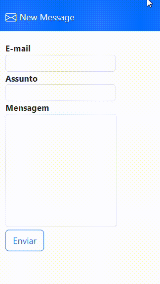

# Send_Mail - HTML/CSS-Bootstrap-PHP

"Send Mail" é uma aplicação de envio de e-mails na qual o usuário insere o endereço de e-mail, assunto e mensagem. Se o usuário não preencher algum dos campos, uma mensagem de alerta será exibida indicando valores vazios. Além disso, se um endereço de e-mail inválido for inserido, uma mensagem de erro será mostrada. Quando todos os campos estiverem preenchidos corretamente, o e-mail será enviado com sucesso e uma mensagem de confirmação será exibida. No entanto, se ocorrer algum erro no PHPMailer durante o envio, uma mensagem de erro será mostrada.

## GIF PC :

## GIF MOBILE :

# KaueNunez-22/02/2024